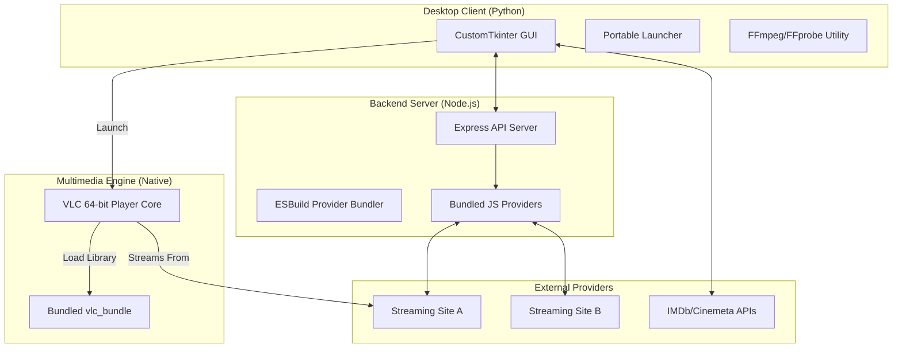
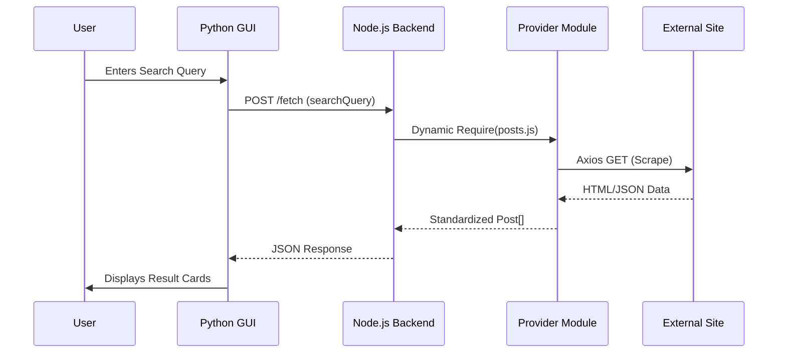
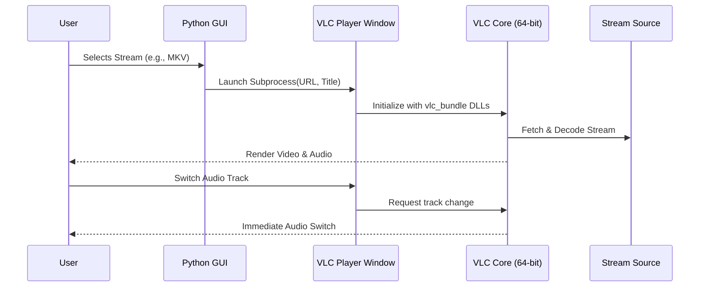

# Vega Providers: System Architecture & Design Documentation

## 1. System Overview
Vega Providers (also known as Vega Hub) is a unified multimedia entertainment platform designed to aggregate content from various third-party streaming providers into a single, high-performance desktop environment. It leverages a hybrid technology stack (Python, Node.js, and Native VLC) to provide a seamless search, discovery, and playback experience.

The system is built on a **modular provider-based architecture**, allowing for easy extension and maintenance of external content sources without modifying the core application logic.

---

## 2. High-Level Architecture
The system consists of three primary layers: the **Desktop Client (Python)**, the **Backend Provider Server (Node.js)**, and the **Multimedia Engine (VLC)**.

---

## 3. Core Components

### 3.1 Desktop Client (Python Layer)
Designed with `CustomTkinter`, this layer manages the user interface, session persistence, and local utility orchestration.
*   **Launcher (`VegaHubLauncher.py`)**: Handles portable execution environment setup, extracts bundled assets (`_MEIPASS`), and manages the lifecycle of the Node.js backend.
*   **Main HUB (`peott.py`)**: The primary navigation controller. It manages asynchronous data fetching, IMDb metadata enrichment, and provider switching.
*   **Internal Player (`player_window.py`)**: A native window powered by `python-vlc` and `customtkinter`. It provides high-performance video decoding, native multi-audio track switching, and robust playback controls (seek, volume, fullscreen).

### 3.2 Backend Provider Server (Node.js Layer)
Acts as a stateless proxy between the Python GUI and the logic-heavy scraping modules.
*   **API Gateway (`dev-server.js`)**: An Express.js server providing endpoints for content fetching (`/fetch`), manifest retrieval (`manifest.json`), and provider discovery.
*   **Dynamic Module Execution**: Uses Node's `require` system to dynamically load and execute bundled provider modules at runtime.

### 3.3 Provider Framework (TypeScript Layer)
Individual modules that implement a standardized interface for interacting with various streaming sites.
*   **Interface Definition (`types.ts`)**: Defines the standardized data structures for Posts, Metadata, and Streams.
*   **Scraping Intelligence**: Utilizes `cheerio` for HTML parsing and `axios` for network requests, often including custom bypass logic (headers, cookies) for specific sites.

### 3.4 Multimedia Engine (VLC Layer)
A high-performance playback system using the VLC native engine.
1.  **Native Multi-Audio**: VLC handles multiple audio tracks within MKV/HLS streams natively, allowing users to switch tracks directly via the UI.
2.  **Architecture Compatibility**: The system includes a **64-bit VLC Bundle** (`vlc_bundle/`) to ensure the application works seamlessly on 64-bit Python environments, resolving common DLL mismatch issues.
3.  **Hardware Acceleration**: Leverages VLC's built-in hardware decoding for smooth 4K and HDR playback.

---

## 4. Operational Workflows

### 4.1 Content Discovery Workflow

### 4.2 Playback Workflow (VLC Native)

---

## 5. Technology Stack

| Category | Technologies |
| :--- | :--- |
| **Frontend** | Python (3.13), CustomTkinter, PIL |
| **Backend** | Node.js, Express, Axios, Cheerio |
| **Bundling** | ESBuild (TypeScript to JS) |
| **Multimedia** | python-vlc, Native libVLC (64-bit) |
| **Packaging** | PyInstaller (Windows Portable EXE) |
| **Metadata** | IMDb API, Cinemeta API |

---

## 6. Deployment & Portability
The application is designed for **Zero-Dependency Portability** on Windows:
*   **Self-Contained Executive**: Compiled using `VegaHub.spec`, bundling the Python interpreter, Node.js binary, and `server.bundle.js`.
*   **Bundled VLC Core**: Includes a dedicated 64-bit VLC distribution in the `vlc_bundle` directory, ensuring compatibility across all Windows 10/11 x64 systems.
*   **Optimized FFmpeg Management**: The GUI includes a streaming installer with progress tracking to fetch `ffmpeg.exe` and `ffprobe.exe` for metadata utility tasks.
