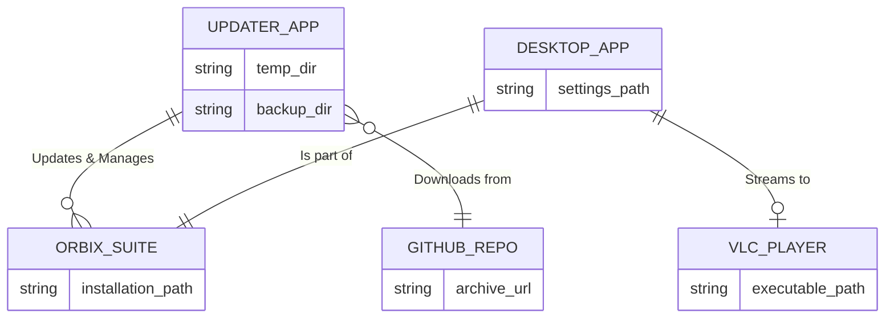
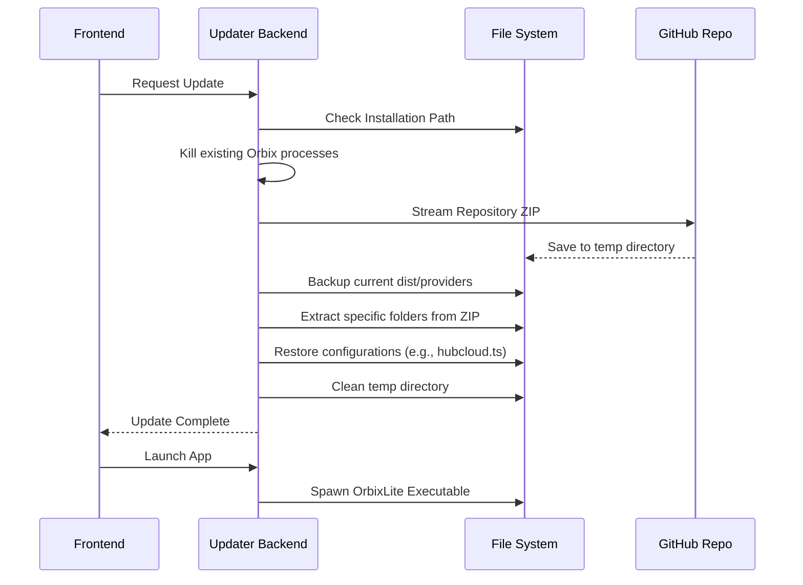
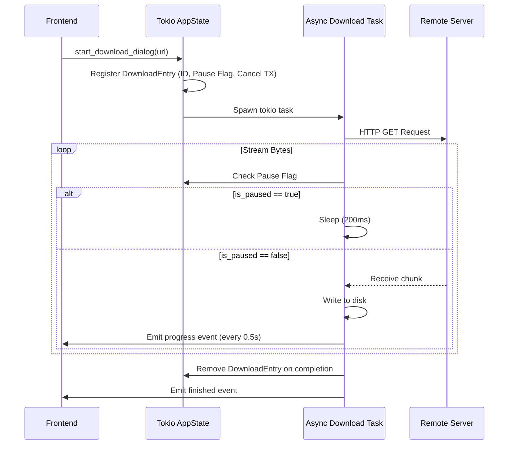

# System Architecture

This document provides a comprehensive overview of the Rust backend architecture for both `orbixplay-updater` and `desktop-app` (OrbixLite), highlighting their differences, system design, and execution flows.

## 1. Overview of Applications

Both applications are built using the **Tauri framework**, combining a web frontend (React/TypeScript) with a highly performant **Rust** backend. 

*   **OrbixPlay Updater**: A dedicated patcher and lifecycle manager for the Orbix Suite. Its primary role is to fetch updates from a remote repository, manage backups, extract new files, and control the lifecycle (launching/killing) of the main applications.
*   **Desktop App (OrbixLite)**: The main media consumption application. Its backend is designed to handle local data persistence, integrate with external native media players (VLC), and manage robust, asynchronous file downloads.

## 2. System Design & Rust Architecture

### OrbixPlay Updater
The updater focuses on **Filesystem Operations** and **Process Management**. It is largely stateless in memory, relying on the OS filesystem as its source of truth.

*   **Core Modules**:
    *   **Network (reqwest)**: Streams ZIP files from GitHub repositories directly to the local disk to minimize memory footprint.
    *   **Filesystem (std::fs, zip)**: Manages creating backups, cleaning target directories, and extracting specific directories (`dist`, `providers`) from the downloaded archives.
    *   **Process Control (sysinfo, std::process)**: Identifies running instances of Orbix apps and forcefully terminates them before an update. It also handles launching the updated executables.

### Desktop App (OrbixLite)
The desktop app handles **Concurrency** and **State Management**.

*   **Core Modules**:
    *   **Async State (Tokio Mutex, AppState)**: Maintains a concurrent `HashMap` of active downloads. Each download has a dedicated thread, a cancellation transmitter (`tokio::sync::broadcast`), and a shared pause flag (`Arc<Mutex<bool>>`).
    *   **Local Database (JSON)**: Implements a custom, lightweight JSON database for user settings, utilizing temporary files and atomic renames to prevent data corruption during unexpected shutdowns.
    *   **External Integration (VLC)**: Dynamically locates the VLC executable on the host machine and spawns it with specific arguments (custom headers, referers) for seamless media streaming.

## 3. Key Architectural Differences

| Feature | OrbixPlay Updater | Desktop App (OrbixLite) |
| :--- | :--- | :--- |
| **Primary Role** | Suite management and patching | User-facing media app |
| **State Management** | Stateless (Filesystem driven) | Stateful (In-memory HashMap with Tokio Mutex) |
| **Concurrency Model** | Sequential execution for file safety | Highly concurrent (multiple async download tasks) |
| **External Dependencies** | Remote GitHub APIs | Local VLC Media Player |
| **Data Persistence** | None (Manages app files directly) | Custom atomic JSON database |

## 4. Entity-Relationship (ER) Diagram

The following diagram illustrates the relationship between the components within the ecosystem.

## 5. Webflow & Process Flow Diagrams

### Updater Update Flow
This flow describes how the updater patches the main application.

### Desktop App Download Flow
This flow details how the desktop app handles robust asynchronous downloads.

